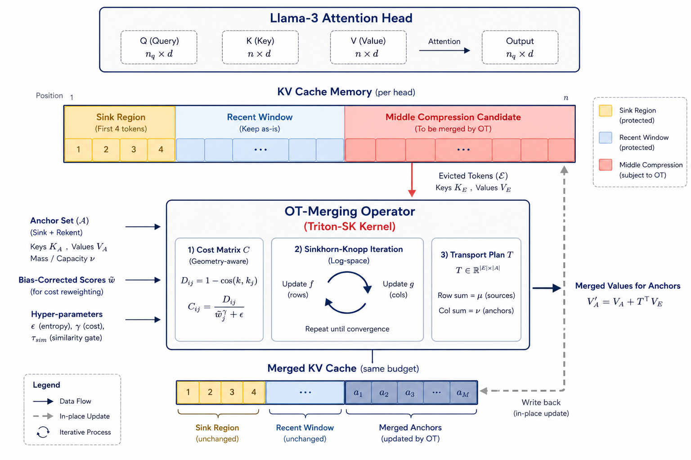
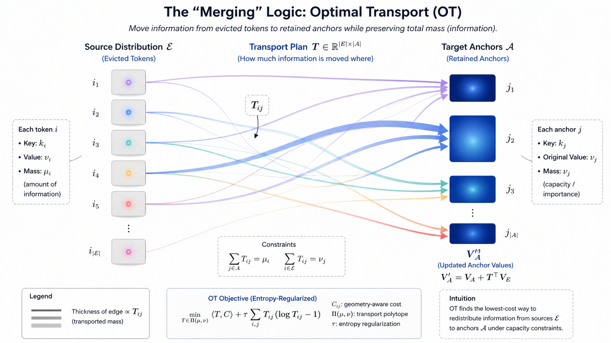

# OT-KV: Information-Preserving KV Cache Compression via Optimal Transport

[](https://opensource.org/licenses/MIT)
[](https://www.python.org/downloads/)
[](https://huggingface.co/)

[cite_start]**OT-KV** is an information-preserving Key-Value (KV) cache compression framework that mitigates positional skew with bias-corrected anchoring and preserves historical context using Optimal Transport[cite: 1, 20, 21].

## 📖 Introduction

[cite_start]Large Language Models (LLMs) increasingly rely on long-context inference for complex reasoning tasks[cite: 4]. [cite_start]However, the Key-Value (KV) cache grows linearly with the sequence length, becoming a major bottleneck for GPU memory and throughput[cite: 5, 6]. 

[cite_start]Traditional compression approaches rely on token eviction (e.g., heavy-hitters or sliding windows), which acts as a hard deletion operation[cite: 8, 11]. [cite_start]Once a token is evicted, its semantic contribution is permanently discarded, often leading to semantic drift in long-context tasks where rare details matter[cite: 11, 62].

[cite_start]**OT-KV** introduces a paradigm shift: **treating KV cache compression as *information redistribution* rather than pure token deletion**[cite: 12]. [cite_start]By treating the evicted token values as a source distribution and the retained anchor tokens as a target distribution, OT-KV uses Optimal Transport (OT) to softly merge evicted historical information into semantically similar and representative anchors[cite: 15, 16, 75]. 

## 🧠 Core Algorithm Pipeline

[cite_start]OT-KV is applied independently per-head and per-layer at the end of the prefill stage[cite: 80]. The pipeline consists of four main steps:

### 1. Cache Partitioning & Bias-Corrected Anchoring
The KV cache is partitioned into three segments to ensure generation coherence:
* [cite_start]**Sink Region (Protected)**: Retains the initial "attention sink" tokens to stabilize softmax normalization[cite: 8, 184].
* [cite_start]**Recent Window (Protected)**: Retains the most recent tokens to preserve local context for autoregressive decoding[cite: 34, 184].
* [cite_start]**Middle Region (Compressible)**: The historical segment where compression is actively applied[cite: 35, 187].

[cite_start]In the middle region, earlier tokens often accumulate high attention scores purely due to causal exposure[cite: 10, 84]. [cite_start]To correct this position bias, OT-KV selects a fixed number of **Anchor tokens** using a bias-corrected representational score derived from the key-vector $l_{2}$-norm and remaining exposure length[cite: 14, 86, 88]. [cite_start]The remaining tokens are designated as **Evicted tokens**[cite: 44].



### 2. Multiplicative Cost Matrix
[cite_start]To determine how evicted tokens should be merged, OT-KV formulates a transport cost matrix $C$[cite: 46, 95]. [cite_start]The cost is defined by the cosine distance between key vectors (capturing semantic similarity), modulated by the bias-corrected importance of the anchors[cite: 16, 48]. [cite_start]This ensures that evicted information is routed to anchors that are both semantically similar and globally representative[cite: 16, 100].

### 3. Log-Space Sinkhorn Iteration
[cite_start]OT-KV seeks a transport plan $T$ that minimizes the total transport cost using entropy-regularized Optimal Transport[cite: 49, 103]. [cite_start]To ensure numerical stability and prevent underflow under half-precision arithmetic (bfloat16 or float16), the Sinkhorn-Knopp algorithm is executed entirely in log space[cite: 108, 114, 276]. 

### 4. Value Merging
[cite_start]Instead of permanently dropping the evicted tokens, OT-KV uses the resulting transport plan $T^*$ to softly redistribute their value mass into the retained anchors[cite: 18, 175]. The anchor values are updated via a matrix addition:
$$V_{\mathcal{A}}' = V_{\mathcal{A}} + (T^*)^\top V_{\mathcal{E}}$$
[cite_start]This step ensures the cache size stays within budget while enriching the retained anchors with the historical context of the removed tokens[cite: 18, 51].




## 🚀 Getting Started

[cite_start]OT-KV is implemented as a drop-in replacement for the standard `DynamicCache` in Hugging Face Transformers[cite: 207]. [cite_start]It requires **no modification to model weights or underlying attention kernels**[cite: 207]. 

### Installation
```bash
git clone [https://github.com/your-username/OT-KV.git](https://github.com/your-username/OT-KV.git)
cd OT-KV
pip install -r requirements.txt
```

### Usage
[cite_start]Our `BaseCompressCache` framework intercepts KV states using forward hooks registered on attention modules[cite: 208]. [cite_start]Compression is triggered automatically at the end of the `prefill` stage[cite: 210].

```python
import torch
from transformers import AutoModelForCausalLM, AutoTokenizer
from otkv.cache import OTKVCache # Hypothetical import based on architecture

model_id = "meta-llama/Meta-Llama-3-8B-Instruct"
tokenizer = AutoTokenizer.from_pretrained(model_id)
model = AutoModelForCausalLM.from_pretrained(model_id, torch_dtype=torch.bfloat16)

# Initialize OT-KV Cache
# Default configs: sink_size=4, recent_size=256, compression_ratio=0.5
ot_cache = OTKVCache(
    budget_ratio=0.5, 
    sink_tokens=4, 
    recent_tokens=256,
    epsilon_ot=0.01 # Entropy regularization parameter
)

inputs = tokenizer("Your long context prompt here...", return_tensors="pt")

# Pass the custom cache to the standard HuggingFace generate method
outputs = model.generate(
    **inputs,
    past_key_values=ot_cache,
    max_new_tokens=100
)

print(tokenizer.decode(outputs[0], skip_special_tokens=True))
```

## 📝 Citation

[cite_start]If you find this repository useful, please consider citing our work[cite: 302]:

```bibtex
@article{ni2026otkv,
  title={OT-KV: Information-Preserving KV Cache Compression via Optimal Transport with Bias-Corrected Anchoring},
  author={Ni, Yi and Wang, Xinkun and Zheng, Zhiheng},
  year={2026},
  institution={Carnegie Mellon University}
}
```